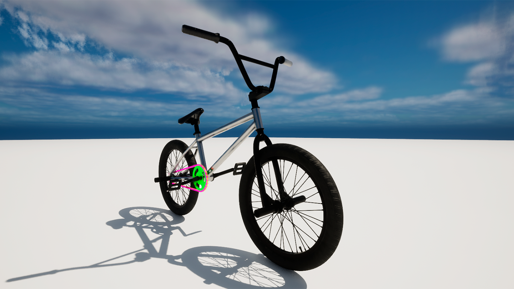
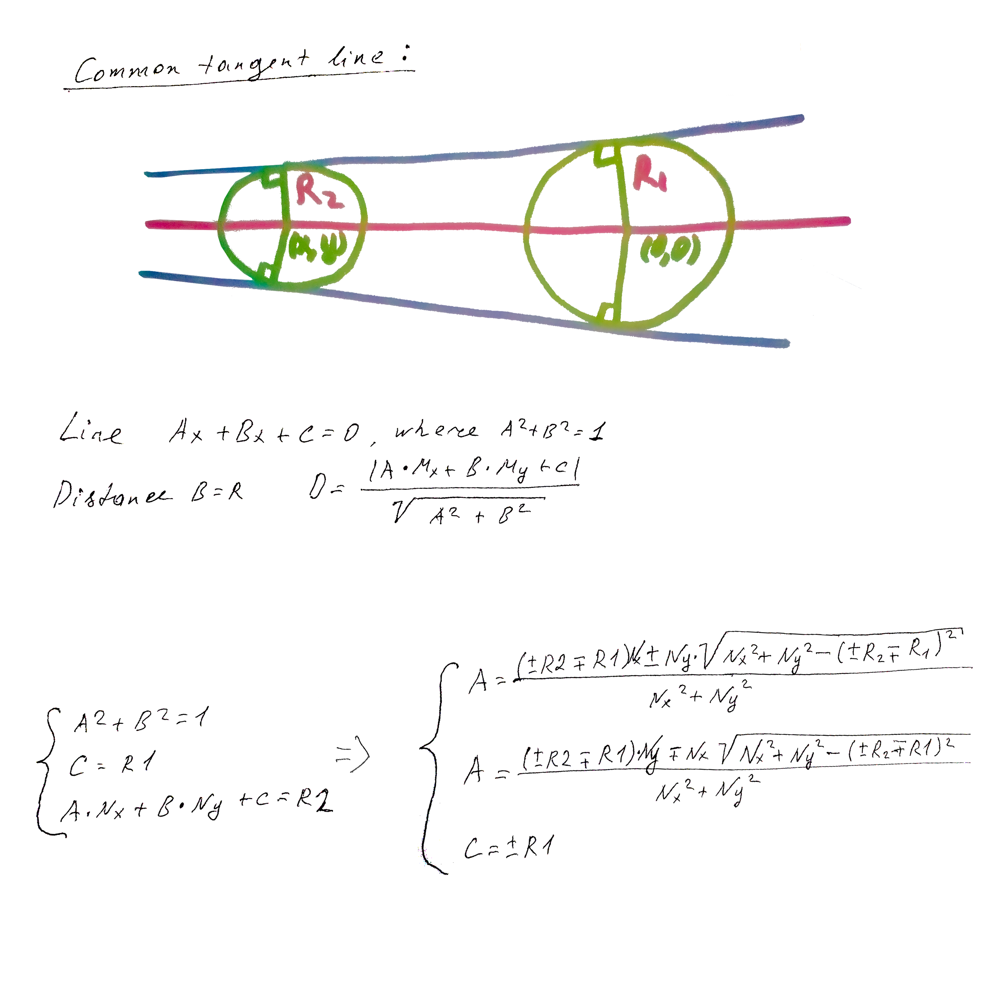
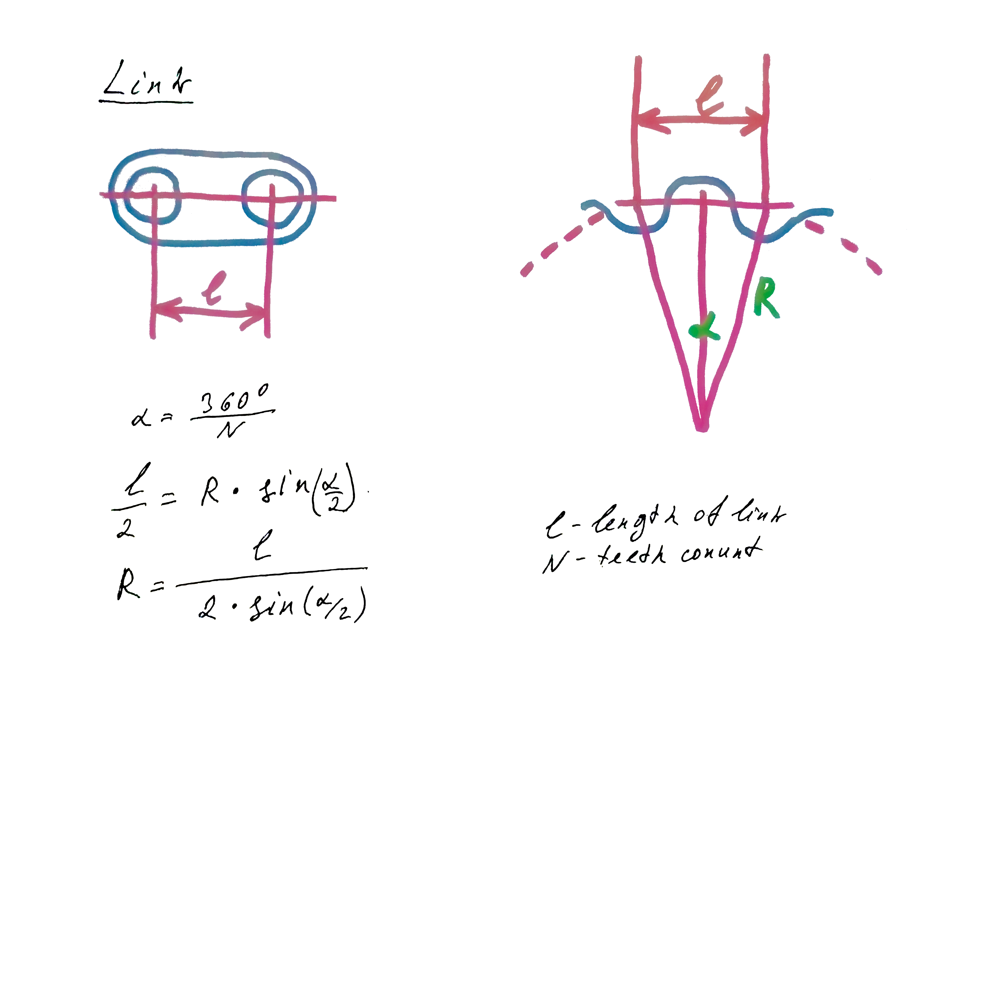
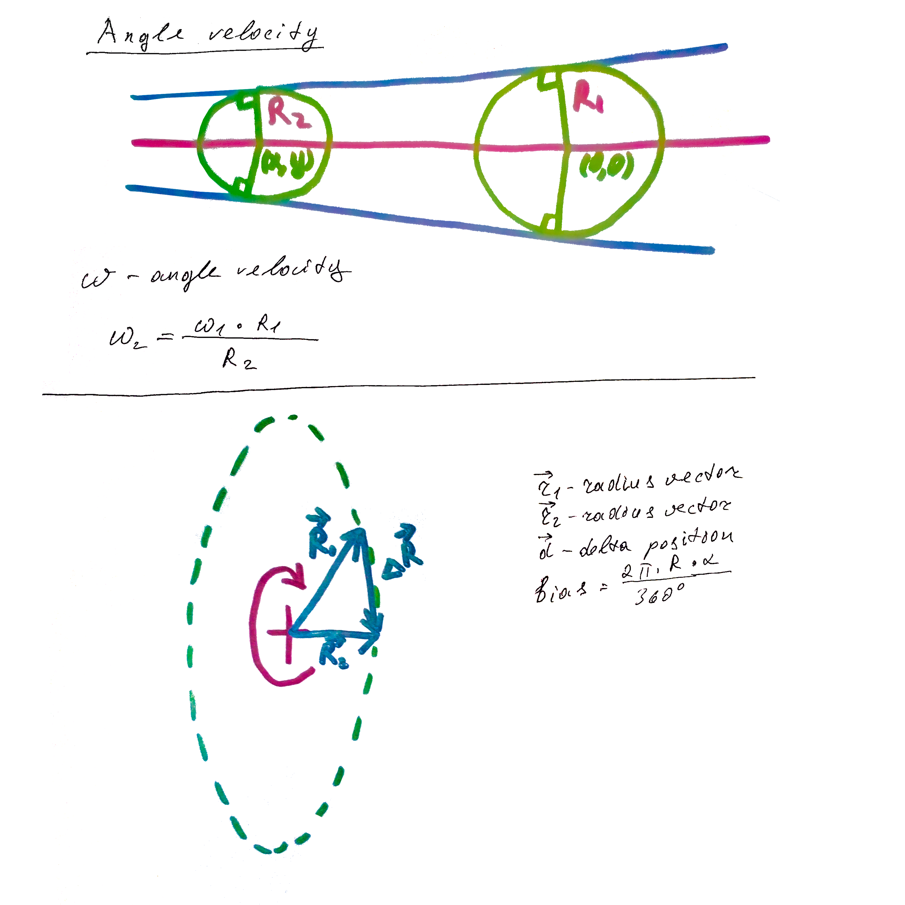

<h1>
    <strong>
        Bike
    </strong>
</h1>   

<h3>
    <strong>
        Unreal Engine 5, C++. 
    </strong>
</h3>

    C++ and a touch of analytical geometry in my first Unreal Engine project.

    
=======
             height="168 alt="Demo video">
>>>>>>> 160df7d6be0d3fa7cb7052ad2b84ae25a19cfc5a

    Below are some of my calculations:

    

    

    

 
<h3><strong>My contacts:</strong></h3>

<a href="mailto:igordmitriev@gmail.com">igordmitriev.uzun@gmail.com</a>

<a href="https://www.linkedin.com/in/igor-uzun">LinkedIn</a>

<a href="https://www.github.com/Uzunig">GitHub</a>

